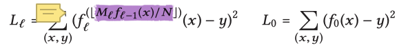

1. The first one is about the two premise that the paper makes at page 490. “monotonic models the only thing we need to do is to execute the model for every key and remember the worst over- and under-prediction of a position to calculate the min- and max-error. 2 Second, and more importantly, the strong error bounds are not even needed.”

   1. What does it mean by a model is monotonic?
   2. Why we don’t need the strong error bounds? I don’t quite understand the explanation of the paper.

2. At page 491, “we only index an in-memory dense array that is sorted by key”

   1. Why the paper made this assumption?
   2. Does it means that the data record should be fit in main memory?

3. 

   This is the loss function that used to train the model, however, I can hardly understand how the purple part works

   Does $M_l$ represent the model? How does a Model multiply a value?